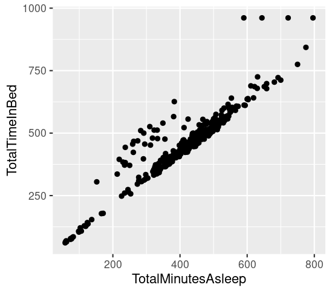
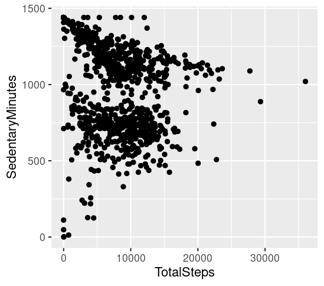

# Bellabeat-Data-Analysis-Case-Study
Case Study 2: How Can a Wellness Technology Company Play It Smart?

Case Study 2: How can a wellness company play it smart?
In this case study, you will perform data analysis for Bellabeat, a high-tech manufacturer of health-focused products for women. You will analyze smart device data to gain insight into how consumers are using their smart devices. Your analysis will help guide future marketing strategies for your team. Along the way, you will perform numerous real-world tasks of a junior data analyst by following the steps of the data analysis process: Ask, Prepare, Process, Analyze, Share, and Act. By the time you are done, you will have a portfolio-ready case study to help you demonstrate your knowledge and skills to potential employers!

Interested? Download the case study packet: [Case Study 2](Case-Study-2.pdf)

---

# Bellabeat Data Analysis

## Introduction
This analysis aims to uncover insights into physical activity, sleep patterns, and their relationship, using data from Bellabeat fitness tracker users.

## Data Sources
- `dailyActivity_merged.csv`: Contains users' daily activity data such as steps, distance, and calories burned.
- `sleepDay_merged.csv`: Includes information about users' sleep patterns, like total minutes asleep and time in bed.

## Methodology
1. Load the datasets into an R environment.
2. Clean the data by checking for inconsistencies, missing values, and outliers.
3. Analyze the `dailyActivity_merged.csv` to extract trends in daily steps and sedentary minutes.
4. Analyze the `sleepDay_merged.csv` to understand the relationship between minutes asleep and time in bed.
5. Use descriptive statistics and visualizations to interpret the data.
6. Save the plots as `relationshipbetweenminutesasleepandtimeinbed.png` and `relationshipbetweenstepstakeninadayandsedentaryminutes.png`.

## Findings
The analysis revealed a positive correlation between the total minutes asleep and the total time in bed. Additionally, a complex relationship between the total steps taken in a day and sedentary minutes was observed, indicating that higher activity levels do not necessarily correlate with fewer sedentary minutes.

## Conclusion
The analysis has highlighted key areas for Bellabeat to focus on to help users improve their sleep and activity patterns. Future recommendations could include personalized activity goals and sleep hygiene tips based on the data-driven insights.

